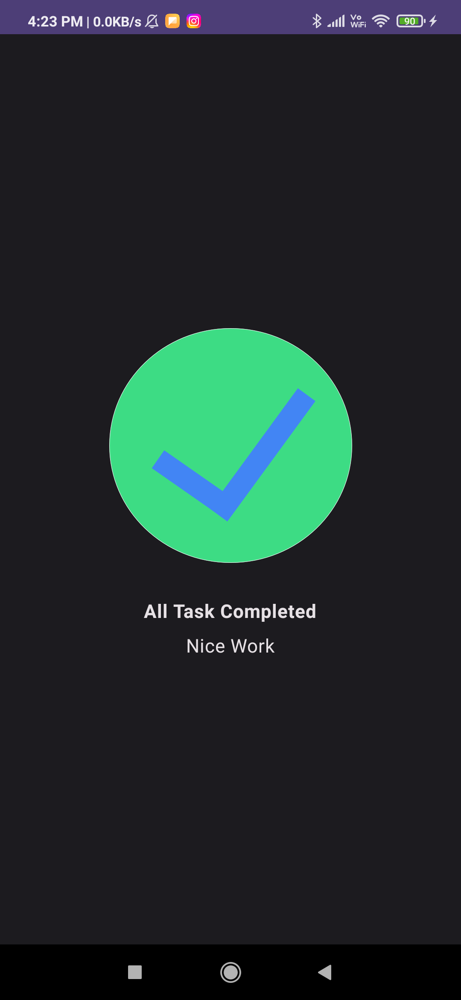

# Task_Manager
The Task Manager app lets users manage their day-to-day tasks and check the tasks that they need to complete.

## i learnt about
* vertical arrangement
* horizontal alignment
* modifiers
  
